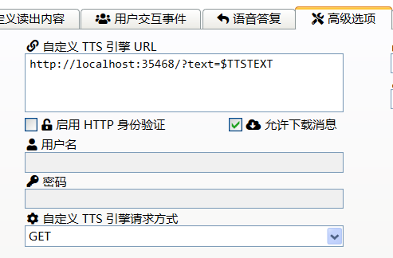

# MsTtsForBiliLiveDm

为 [RE-TTSCat](https://github.com/Elepover/RE-TTSCat) 编写的自定义 TTS 引擎，提供简单的请求 API。

## 使用方法

在插件管理页面设置 TTS 引擎监听的端口号以及使用的语音类型。

在 RE-TTSCat `插件设置 - 高级选项 - 自定义TTS引擎URL` 填入对应的 API, 请求方式为 GET。例如：

```
http://localhost:35468/?text=$TTSTEXT
```

对应端口设置为 35468 时的 API。



## 注意事项

微软网页演示的请求次数和频率有限制，请合理调用（比如什么进入直播间就不要说了）

目前插件的配置文件和弹幕姬本体保存在相同目录，弹幕姬自动升级时很有可能丢掉配置文件 ~~……和别的插件一样保存到 `Documents/弹幕姬/` 当然可以做，但是为什么一定是 `Documents` 呢？~~

下个版本改到插件dll文件旁边，学会不用硬编码的方法了。


## //TODO

- 连接Azure的非演示版本TTS服务
- 提供一些别的TTS API，例如[偷懒工具](https://toolight.cn/media/reading)